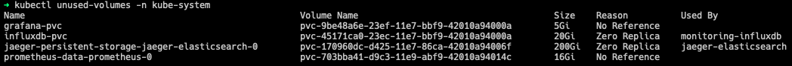

# kubectl-unused-volumes

A `kubectl` plugin to gather all PVC and output all pvcs that doesn't belong to any workloads.
This plugins checks for standard kubernetes workloads : 
- DaemonSet
- Deployment
- Job
- StatefulSet


## Quick Start

Install unused-volumes via [krew](https://krew.sigs.k8s.io/)

```
kubectl krew install unused-volumes

# Scan for all unused volumes in current context and default namespace

kubectl unused-volumes
```

## Demo

